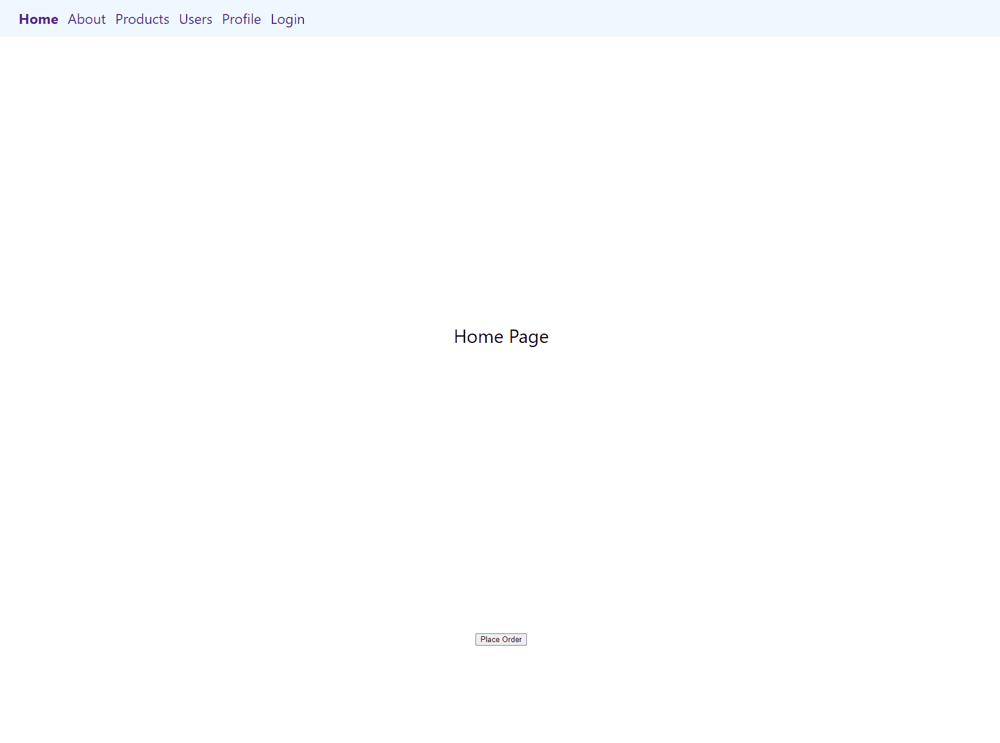

React Router Demo: Navigating the World of Routing
==================================================     

[Live demo website](https://utkarsh-react-router-demo.netlify.app/)

The "React Router Demo" GitHub repository is a comprehensive demonstration of the capabilities and use cases of the react-router-dom library. This library is a vital tool for implementing client and server-side routing in React applications. React itself is a JavaScript library renowned for building dynamic user interfaces and react-router-dom seamlessly integrates routing into React applications.

## Key Features:

1. *Routing Mastery*: Explore demo code that illustrates various routing scenarios, helping you grasp the full potential of react-router-dom.

2. *Versatile Compatibility*: react-router-dom is versatile, running smoothly on web browsers, server environments with Node.js and even React Native, ensuring a consistent routing experience across platforms.

3. *Educational Resource*: Whether you're a seasoned developer or just starting with React, this repository serves as an educational resource, offering insights into best practices and advanced routing concepts.

4. *Universal Routing*: Learn how to create routing solutions that work on both client and server sides, facilitating SEO optimization and improving user experiences.

The "React Router Demo" repository isn't just about code; it's a gateway to mastering routing in React applications. Whether you're a developer, a React enthusiast or someone looking to enhance their knowledge of client and server-side routing, this project provides a rich learning experience. Dive in, explore the demo scenarios, and unlock the full potential of react-router-dom to navigate the ever-evolving world of web development.

